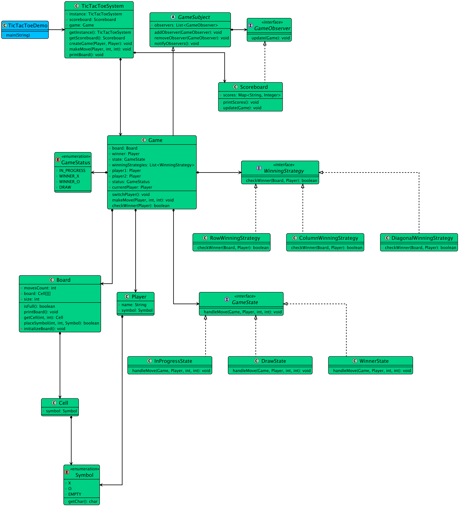

# Tic-Tac-Toe — Low Level Design

## Problem Statement

Design a console-based Tic-Tac-Toe game for two human players. The game should manage the board, validate moves, detect wins and draws, and loop through turns until the game ends.

---

## Requirements

1. The game is played on a 3×3 grid by two players.
2. Players alternate placing their symbol (X or O) on an empty cell.
3. The first player to fill a complete row, column, or diagonal wins.
4. If all 9 cells are filled with no winner, the game ends in a draw.
5. The board is printed after every move.
6. Invalid moves (out-of-bounds coordinates or already-occupied cells) are rejected and the player is prompted again.

---

## Project Structure

```
tictactoe/
├── player.go          # Player struct (name + symbol)
├── board.go           # Board state, move validation, win detection
├── game.go            # Game loop, player switching, input handling
└── tictactoe_play.go  # Entry point / demo
```

---

## Class Diagram



---

## Design Patterns Used

| Pattern | Where | Why |
|---|---|---|
| **Factory** | `NewPlayer`, `NewBoard`, `NewGame` | Each constructor encapsulates all initialization logic. Callers cannot forget to set a required field. |
| **Turn-based State Machine** | `Game.switchPlayer` | The game has exactly two states — Player 1's turn and Player 2's turn. `switchPlayer` is the transition function between them. |

---

## File-by-File Breakdown

### `player.go` — The Player

```
Player {
    Name   string   ← display name, e.g. "Ayush"
    Symbol rune     ← 'X' or 'O', placed on the board
}
```

**Why `rune` for Symbol?**
A `rune` is Go's Unicode code point type. Single characters like `'X'` and `'O'` are runes. The Board's grid is also `[3][3]rune`, so writing `grid[row][col] = player.Symbol` is a direct assignment with no type conversion.

#### Functions

| Function | What it does | Why |
|---|---|---|
| `NewPlayer(name string, symbol rune) *Player` | Creates a Player with the given name and symbol. | Factory constructor. Ensures a Player is always created fully initialized. In a larger system this is where you'd validate that the symbol is `'X'` or `'O'` and not something else. |

---

### `board.go` — The Game Board

The Board is the single source of truth for the game state. It owns the grid and knows whether the game is over.

```
Board {
    Grid       [3][3]rune   ← 3×3 grid, '_' = empty cell
    MovesCount int          ← total moves made so far
}
```

**Why track `MovesCount`?**
`IsFull()` can be answered in O(1) by checking `MovesCount == 9` instead of scanning all 9 cells every turn. The count is incremented exactly once per valid move inside `MakeMove`, so it can never go out of sync with the grid.

**Why `'_'` for empty cells?**
It's a printable character that's visually distinct from `'X'` and `'O'`. It also acts as a sentinel in `HasWinner`: a line of three `'_'` is not a win (`!= '_'` is checked first), so we don't need a separate "cell is empty" check in the win logic.

#### Functions

| Function | What it does | Why |
|---|---|---|
| `NewBoard() *Board` | Allocates a Board and calls `InitializeBoard`. | Factory. Guarantees the grid is always clean when handed to `NewGame`. |
| `InitializeBoard()` | Sets every cell to `'_'` and resets `MovesCount` to 0. | Separated from `NewBoard` so it could be called to reset a board for a rematch without allocating new memory. |
| `MakeMove(row, col int, symbol rune) error` | Validates the coordinates (0–2) and checks the cell is empty (`'_'`). If valid, writes the symbol and increments `MovesCount`. Returns an error on invalid input. | Returns an error (not a bool) so the caller gets a human-readable message like `"invalid move"` to show the player. The `Game.Play` loop catches this error and re-prompts without switching players. |
| `IsFull() bool` | Returns `true` when `MovesCount == 9`. | O(1) draw check. Called every loop iteration to break the game loop when the board is full. |
| `HasWinner() bool` | Checks all 3 rows, all 3 columns, and both diagonals for a line of 3 identical non-empty symbols. Returns `true` if any line is complete. | Win detection runs after every move. Checking all 8 possible winning lines is O(1) since the board is always 3×3. The `!= '_'` guard prevents three empty cells from counting as a win. |
| `PrintBoard()` | Prints the 3×3 grid to stdout, row by row, with a blank line after. | Shows the board state after every move and at game start. Keeps the display logic in the Board (which owns the data) rather than scattering print statements in Game. |

**`HasWinner` — how all 8 lines are checked:**

```
Rows:       Grid[r][0] == Grid[r][1] == Grid[r][2]  for r in {0,1,2}
Columns:    Grid[0][c] == Grid[1][c] == Grid[2][c]  for c in {0,1,2}
Diagonal 1: Grid[0][0] == Grid[1][1] == Grid[2][2]
Diagonal 2: Grid[0][2] == Grid[1][1] == Grid[2][0]
```

Each check short-circuits: if a row match is found, the function returns `true` immediately without checking the rest.

---

### `game.go` — The Game Loop

`Game` is the orchestrator. It knows who the players are, holds the board, and drives the turn-by-turn loop.

```
Game {
    Player1       *Player
    Player2       *Player
    Board         *Board
    CurrentPlayer *Player   ← points to whoever's turn it is
}
```

**Why store `CurrentPlayer` as a pointer to Player1/Player2?**
`switchPlayer` toggles `CurrentPlayer` between `Player1` and `Player2` using pointer comparison (`g.CurrentPlayer == g.Player1`). This avoids copying Player structs and makes the switch an O(1) pointer swap.

#### Functions

| Function | What it does | Why |
|---|---|---|
| `NewGame(player1, player2 Player) *Game` | Creates a Game with a fresh board. Sets `CurrentPlayer` to Player1 so Player1 always goes first. | Factory. Wires all dependencies together. Player1 always has first move — a convention consistent with real Tic-Tac-Toe. |
| `Play()` | The main game loop. Prints the board, then repeatedly: prompts the current player, reads row/col, calls `MakeMove`, prints the board, switches player. Loop exits when `IsFull()` or `HasWinner()` is true. Then announces the winner or draw. | All game flow lives here. The loop condition checks both end states before each turn so neither is missed. |
| `switchPlayer()` | Flips `CurrentPlayer` between `Player1` and `Player2`. | The turn-based state machine transition. Called after every **valid** move. If a move is invalid (MakeMove returns error), `switchPlayer` is NOT called — the same player gets another chance. |
| `getValidInput(prompt string) int` | Prints the prompt, reads a line from stdin, parses it as an integer. Loops until the user enters a number between 0 and 2 (inclusive). Returns the valid integer. | Handles all input validation in one place. Uses `bufio.Scanner` for reliable line reading. The loop ensures `Play` never receives an out-of-range coordinate. |

**The winner announcement subtlety:**

```go
if g.Board.HasWinner() {
    g.switchPlayer() // switch BACK to the winner
    fmt.Printf("%s wins!", g.CurrentPlayer.Name)
}
```

After a winning move, `switchPlayer` was called — so `CurrentPlayer` is now the *other* player. To announce the winner we call `switchPlayer` one more time to point back to the player who just won. This is a deliberate reversal, not a mistake.

---

### `tictactoe_play.go` — The Entry Point

```go
func Run() {
    player1 := NewPlayer("Ayush", 'X')
    player2 := NewPlayer("Rahul", 'O')
    game := NewGame(*player1, *player2)
    game.Play()
}
```

**What it does:** Creates two players, wires them into a new game, and starts the interactive loop. This function is called from the top-level `main.go`.

---

## End-to-End Flow

```
Run()
 └─ NewPlayer("Ayush", 'X')        → Player{Name: "Ayush", Symbol: 'X'}
 └─ NewPlayer("Rahul", 'O')        → Player{Name: "Rahul", Symbol: 'O'}
 └─ NewGame(player1, player2)
      └─ NewBoard()
           └─ InitializeBoard()    → 3×3 grid of '_', MovesCount = 0
      └─ CurrentPlayer = &Player1
 └─ game.Play()
      └─ Board.PrintBoard()        → prints empty grid
      └─ loop while !IsFull() && !HasWinner():
           └─ prompt current player for row, col
           └─ getValidInput(...)   → validated 0-2 integer
           └─ Board.MakeMove(row, col, symbol)
                └─ if invalid: print error, continue (no switchPlayer)
                └─ if valid: write symbol, MovesCount++
           └─ Board.PrintBoard()   → print updated grid
           └─ switchPlayer()       → toggle CurrentPlayer
      └─ if HasWinner(): switchPlayer() then print winner
      └─ else: print "It's a draw!"
```

---

## Key Design Decisions & Trade-offs

| Decision | Alternative | Why this approach |
|---|---|---|
| Board owns win detection | Game checks win | Board owns the grid data, so win logic belongs there. Keeping it in Game would mean Game reaches into Board's internals. |
| `MovesCount` for full-board check | Scan all 9 cells | O(1) vs O(9). Trivial here but good habit. |
| `rune` for cell values | `string` or `byte` | Direct grid write with no conversion. `rune` matches Go's character type. |
| `bufio.Scanner` for input | `fmt.Scan` | Scanner handles edge cases (empty input, non-numeric strings) more gracefully. |
| No AI player | Add minimax | Scope is two human players. Adding AI is an extension — the interface allows it since `Player` just has Name + Symbol. |
